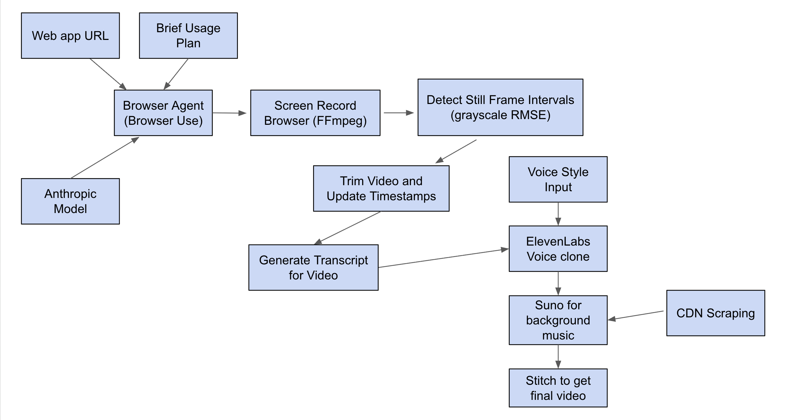

# Spotlight - AI-Powered Demo Video Creator

**Spotlight** is an innovative AI system that automatically creates polished, narrated demo videos from just a URL and description. Perfect for product demos, tutorials, and automated documentation.

## What It Does

Spotlight transforms a simple web URL and task description into a professional demo video with:
- **Automated browser interaction** via AI agents
- **Intelligent video editing** with stillness detection and trimming
- **AI-generated voiceover** with voice cloning capabilities
- **Dynamic background music** from Suno AI
- **Professional captions** and subtitles

### See It In Action
Here's a real example of Spotlight in action - watch how it automatically creates a polished demo video from a simple GitHub URL:

<div align="center">
  <a href="https://github.com/user-attachments/assets/c00bbfc9-037a-41fc-8602-5b5cc24e7e49">
    
  </a>
  <p><em>Click to watch the demo video!</em></p>
</div>

*This demo shows Spotlight automatically navigating GitHub, signing in, and creating a new repository with an informative voiceover with voice cloning and background music.*

## How It Works

### Visual Overview
The diagram below shows our complete AI-powered pipeline from URL input to final video output:



### Technical Pipeline

The system follows a sophisticated pipeline:

1. **Browser Agent** - Uses Anthropic Claude with browser automation to interact with websites
2. **Screen Recording** - Captures full desktop activity during automation
3. **Stillness Detection** - Identifies and removes boring static sections
4. **Video Trimming** - Creates tight, engaging cuts with timestamp remapping
5. **Transcript Generation** - AI creates natural voiceover scripts from agent actions
6. **Voice Synthesis** - ElevenLabs clones your voice or uses professional voices
7. **Audio Mixing** - Combines voiceover with background music and original audio
8. **Final Assembly** - Produces polished MP4 with burned-in subtitles

## Use Cases

- **Product Demos**: Showcase your web application features
- **Onboarding Videos**: Create user guides automatically
- **Documentation**: Visual tutorials for complex workflows
- **Marketing Content**: Professional demo videos at scale
- **Training Materials**: Consistent, reproducible instructional content

## Prerequisites

- **Python 3.11+**
- **Node.js 18+**
- **FFmpeg** (for video processing)
- **OpenCV** (for computer vision)

### API Keys Required

- **Anthropic API Key** (for Claude AI agent)
- **ElevenLabs API Key** (for voice synthesis)
- **Suno API Key** (for background music generation)

## Quick Start

### 1. Clone and Setup Backend

```bash
git clone <repository-url>
cd hackmit_2025

# Setup Python environment
cd backend
pip install -r requirements.txt

# Configure environment variables
cp .env.example .env
# Edit .env with your API keys:
# ANTHROPIC_API_KEY=your_anthropic_key
# ELEVENLABS_API_KEY=your_elevenlabs_key
# SUNO_API_KEY=your_suno_key
```

### 2. Setup Frontend

```bash
cd ../frontend
npm install
npm run dev
```

### 3. Start Backend Server

```bash
cd ../backend
uvicorn api:app --reload
```

## Usage

### Web Interface

1. **Enter URL**: Provide the website you want to demo
2. **Describe Task**: Tell the AI what actions to perform
3. **Record Voice**: Provide a short clip voice sample for cloning
4. **Generate**: Watch the magic happen! Play Snake while you wait

### Github Example Demonstration

```bash
# Basic github demo generation
python3 run_github_demo.py
```

## Configuration

### Video Settings

Modify settings in `backend/trim_from_history.py`:
- `still_min_seconds`: Minimum duration to consider "still" (default: 2.5s)
- `diff_threshold`: Sensitivity for detecting motion (default: 1.2)
- `frame_step`: Frame sampling rate for analysis (default: 3)

### Voice & Audio

Adjust in `backend/api.py`:
- Voice cloning vs. default voice: `USE_VOICE` flag
- Background music volume: `-18dB` reduction
- Audio ducking: `-15dB` during voiceover

### Agent Behavior

Configure browser agent in `backend/main.py`:
- `max_actions_per_step`: Actions per thinking cycle (default: 3)
- `max_failures`: Retry attempts (default: 3)
- `max_steps`: Total automation steps (default: 40)

## Project Structure

```
hackmit_2025/
├── backend/                    # Python backend services
│   ├── api.py                 # FastAPI server with streaming endpoints
│   ├── main.py                # Core agent automation logic
│   ├── trim_from_history.py   # Video editing and stillness detection
│   ├── fit_transcript.py      # AI transcript generation and timing
│   ├── elevenlabs_tts.py      # Voice synthesis integration
│   ├── audio_generation.py    # Suno music generation
│   ├── screen_record.py       # Cross-platform screen recording
│   └── artifacts/             # Generated videos, audio, logs
├── frontend/                   # React TypeScript frontend
│   ├── src/
│   │   ├── App.tsx           # Main application component
│   │   ├── components/       # UI components
│   │   │   ├── AudioRecorder.tsx  # Voice recording widget
│   │   │   └── Snake.tsx     # Entertainment during processing
│   │   └── styles.css        # Application styling
│   └── public/               # Static assets
└── README.md                 # This file
```

## Key Features

### Intelligent Browser Automation
- **Multi-step reasoning**: Claude-powered agent plans and executes complex workflows
- **Error recovery**: Automatic retry with failure analysis
- **Context awareness**: Understands page state and user intent

### Smart Video Editing
- **Detect Still Frames**: Detects static scenes for removal
- **Timeline remapping**: Maintains accurate timestamps after cuts
- **Adaptive trimming**: Preserves important action sequences

### Professional Audio
- **Voice cloning**: Personal voice synthesis from short samples
- **Background scoring**: AI-generated ambient music
- **Audio mixing**: Professional multi-layer composition

### Production Ready
- **Streaming API**: Real-time progress updates
- **Error handling**: Graceful fallbacks and recovery
- **Scalable**: Designed for high-volume processing

## Advanced Usage

### Custom Voice Models

```python
# Upload custom voice
voice_id = upload_reference_voice("path/to/voice.wav", "My Voice")

# Use in synthesis
synthesize_to_file(voice_id, "Hello world", "output.wav")
```

### Background Music Generation

```python
# Generate custom background music
music_path = generate_background_music(
    "upbeat tech demo music", 
    target_duration_seconds=120
)
```

### Video Processing Pipeline

```python
# Manual video processing
jumpcut_video(
    input_path="raw_recording.mp4",
    output_path="trimmed.mp4",
    mode="cut",
    still_min_seconds=3.0
)
```

---

**Built for HackMIT 2025**

Transform any website into a professional demo video with the power of AI!